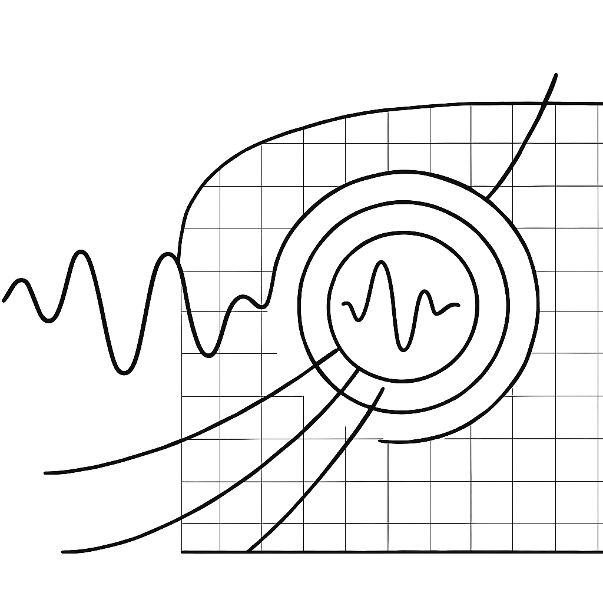

TimeFrequencyWaveforms Documentation
====================================

Author: Christopher J. Moore

A fast, JAX-based Python package to take the wavelet transforms of harmonic-based GW waveform model.

Two types of transform are possible: one that transforms from the time-domain (TD) to the time-frequency domain (TFD),
i.e. the TD :math:`\rightarrow` TFD transform; and  another that transforms from the frequency-domain (FD) to the 
time-frequency domain (TFD); i.e. the FD :math:`\rightarrow` TFD transform.
Currenlty, only the TD :math:`\rightarrow` TFD transform is implemented.

The project lives on `GitHub <https://github.com/cjm96/Time_Frequency_Waveforms>`_.

.. toctree::
   :maxdepth: 5
   :caption: Mathematical Background:

   theory

.. toctree::
   :maxdepth: 7
   :caption: Package Contents:

   api/TimeFrequencyWaveforms.code.utils.rst
   api/TimeFrequencyWaveforms.code.TD_to_TFD_transform.rst
   

.. toctree::
   :maxdepth: 5
   :caption: Code Repository:

   GitHub