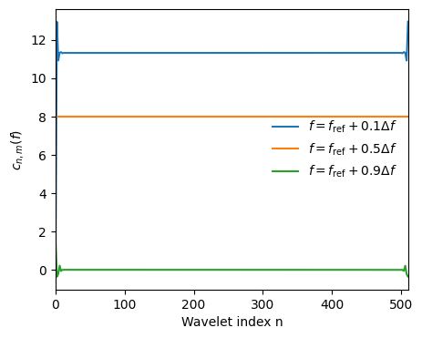

=======================
Mathematical Background
=======================

This section describes the mathematical background to the fast wavelet transform of harmonic-based GW waveform models.

.. contents::
   :local:

Introduction
------------

Gravitational waveform models are usually constructed in either the time domain 
(TD; :math:`h_+(t)`, :math:`h_\times(t)`) or the frequency domain (FD; 
:math:`\tilde{h}_+(f)`, :math:`\tilde{h}_\times(f)`).
If gravitational wave data analysis is to be performed in the time-frequency domain 
(TFD) then it is also necessary to transform our models into this TFD. 

This document describes a fast method for transforming harmonic-based waveforms from either the 
time to the time-frequency domain (TD :math:`\rightarrow` TFD) of from the 
frequency to the time-frequency domain (FD  :math:`\rightarrow` TFD).
These fast transforms rely on expanding the waveform phase (e.g.\ as a function of time) in each harmonic. 
This requires that the frequency is slowly varying over the scale of the wavelets.
These fast transforms have some similarities with the stationary phase approximation which is used 
to compute the Fourier transform between the time and frequency domains.

The next section starts by reviewing the Wilson-Daubechies-Meyer (WDM) wavelets which are used 
throughout as a basis for the TFD.  
The fast TD :math:`\rightarrow` TFD and FD :math:`\rightarrow` TFD transforms are described in 
subsequent two sections respectively.

WDM Wavelets
------------

The WDM family of wavelets are implemented in the `WDM\_GW\_wavelets` package 
`(GitHub) <https://cjm96.github.io/WDM_GW_wavelets/theory.html#/>`_;
see also Ref. [1]_ and Ref. [2]_.
The basis wavelets can be written as

.. math::

    g_{nm}(t) = 
        \begin{cases}
        \sqrt{2} \cos\left(2\pi m [t-n\Delta T] \Delta F\right) \phi(t-n\Delta T) & \mathrm{if}\;n+m\;\mathrm{even} \\
        \sqrt{2} (-1)^{nm} \sin\left(2\pi m [t-n\Delta T] \Delta F\right) \phi(t-n\Delta T) & \mathrm{if}\;n+m\;\mathrm{odd} 
    \end{cases} ,

where :math:`\phi(t)`` is a universal window function.
The :math:`n` index shifts the central time :math:`n\Delta T`` of the wavelet while the 
:math:`m` index shifts the central frequency :math:`m\Delta F`.
The wavelet time and frequency resolutions satisfy :math:`\Delta F \Delta T=1/2`.
These expressions hold for all values of :math:`n=0,1,\ldots, N_{t}-1`` but only for non-zero values of 
:math:`m=1,2,\ldots, N_{f}-1`; the :math:`m=0` wavelets store the zero and Nyquist frequency components of the signal 
and have to be handled separately.
It will also be necessary to use the dual WDM wavelet basis;

.. math::
 
    \hat{g}_{nm}(t) = 
        \begin{cases}
        \sqrt{2} \sin\left(2\pi m [t-n\Delta T] \Delta F\right) \phi(t-n\Delta T) & \mathrm{if}\;n+m\;\mathrm{even} \\
        \sqrt{2} (-1)^{nm} \cos\left(2\pi m [t-n\Delta T] \Delta F\right) \phi(t-n\Delta T) & \mathrm{if}\;n+m\;\mathrm{odd} \\
    \end{cases}.

The two bases are related by a time shift :math:`\Delta T/2`` and span exactly the same space; see the 
discussion in Ref. [1]_.

Fast Wavelet Transform (TD :math:`\rightarrow` TFD)
---------------------------------------------------

Suppose we are given a waveform in the TD defined in terms of its amplitude :math:`A(t)` and phase :math:`\Phi(t)`,

.. math::

    h(t) \equiv h^+(t)-ih^\times(t) = A(t) \exp\big(i \Phi(t)\big) .

Suppose the amplitude and frequency (:math:`2\pi f(t) = \mathrm{d}\Phi/\mathrm{d}t`) change slowly with time; 
i.e.\ they change by a small amount over the wavelet timescale :math:`\Delta T`. 
This is a signal harmonic and a waveform may contain a sum of such harmonics.
This is what is meant above by "harmonic-based waveform".

The wavelet coefficients are defined as

.. math::

    w_{nm} \equiv w^+_{nm} -i w^\times_{nm} = \int_{-\infty}^\infty\mathrm{d}t\;h(t)g_{nm}(t).

Strictly speaking the wavelet coefficients for the discrete wavelet transform involve a sum (not an integral) over 
the time series :math:`t_i=i\delta t$`for :math:`i=0,1,\ldots, N-1`, where :math:`N=N_t N_f`.
However, most of our expressions will be unaffected by changing from a sum to an integral so we continue to use 
this nicer notation. 

The basis wavelet :math:`g_{nm}(t)` is well localised around the time :math:`t\sim t_n\pm\Delta T`. 
Motivated by the fact that the amplitude and frequency are slowly varying, we Taylor expand these quantities about 
:math:`t_n`;

.. math::

    A(t) = A(t_n) + \mathcal{O}(t-t_n) 

.. math::

    \Phi(t) = \Phi(t_n) + 2\pi f(t_n) (t-t_n) + \pi \dot{f}(t_n) (t-t_n)^2 + \mathcal{O}\big((t-t_n)^3\big) 

where 

.. math::

    f(t) = \frac{1}{2\pi}\frac{\mathrm{d}}{\mathrm{d}t}\Phi(t)

and

.. math::

    \dot{f}(t) = \frac{1}{2\pi}\frac{\mathrm{d}^2}{\mathrm{d}t^2}\Phi(t)

and so on for higher derivatives.

It is important that the amplitude is expanded only to zeroth order (as shown above) but the phase can be expanded to 
any order depending on the accuracy needed.
Substituting these expansions into the definition of the wavelet coefficients gives

.. math::

    w_{nm} = A(t_n)\exp\big(i\Phi(t_n)\big)\left(c_{nm}\big(f(t_n),\dot{f}(t_n), \ldots\big) + i s_{nm}\big(f(t_n),\dot{f}(t_n), \ldots\big) \right),

where we have defined

.. math::

    c_{nm}(f, \dot{f}, \ldots) = \int\mathrm{d}t\;\cos X_n(f, \dot{f}, \ldots) g_{nm}(t) ,

.. math::

    s_{nm}(f, \dot{f}, \ldots) = \int\mathrm{d}t\;\sin X_n(f, \dot{f}, \ldots) g_{nm}(t) , 

where 

.. math::
    
    X_n(f,\dot{f},\ldots) = 2\pi(t-n\Delta T)f+\pi(t-n\Delta T)^2\dot{f} + \ldots \quad .

It will also be necessary to use the dual coefficients :math:`\hat{c}_{nm}` and :math:`\hat{s}_{nm}` defined similarly using 
:math:`\hat{g}_{nm}`.

Our approach will be to evaluate the waveform amplitude (:math:`A(t_n)`), phase (:math:`\Phi(t_n)`), and as many phase derivatives (:math:`f(t_n)`, :math:`\dot{f}(t_n)`, ...) as required at the wavelet times :math:`t_n`; 
note, that this is much sparser grid of times than that of the original time series.
We will then evaluate the quantities :math:`c_{nm}` and :math:`s_{nm}` by interpolating these as functions of 
:math:`f`, :math:`\dot{f}`, ... over a precomputed grid of points.
Finally, the wavelet coefficients will be obtained using the above expression for :math:`w_{nm}`.
By pre-computing and interpolating :math:`c_{nm}` and :math:`s_{nm}` this approach amortizes the cost of evaluating the oscillatory integrals 
over time involved in transforming to the TFD.

The interpolation of the :math:`c_{nm}` and :math:`s_{nm}` coefficients is greatly aided by the following observations: 
first, to a good approximation the coefficients only depend on the parity of the index :math:`n`; 
and second, these quantities have a shift symmetry in frequency which relates the coefficients at a frequency 
:math:`f` to the coefficients at :math:`f+2\Delta F`.
The importance of the first observation is that it means it only necessary to interpolate one row of the coefficient matrices. 
The importance of the second observation is that it is only necessary to interpolate over a narrow range of frequencies and the 
coefficients at any frequency can then be obtained by shifting by even multiples of :math:`\Delta F`.
We now describe these two observations in turn.

OBSERVATION 1: 

This observation means the coefficients only depend on the parity of the index :math:`n`.
This can be made precise using the following results derived in appendix A that relate the coefficients at a general 
:math:`n` to the coefficients at a fixed even index :math:`\mathcal{N}`;

.. math::

    c_{nm}(f, \dot{f},\ldots) = \begin{cases}
        c_{\mathcal{N}m}(f, \dot{f},\ldots) & \mathrm{if}\;n\;\mathrm{is}\;\mathrm{even} \\
        \hat{c}_{\mathcal{N}m}(f, \dot{f},\ldots) & \mathrm{if}\;n\;\mathrm{is}\;\mathrm{odd}
    \end{cases} ,

.. math::

    s_{nm}(f, \dot{f},\ldots) = \begin{cases}
        s_{\mathcal{N}m}(f, \dot{f},\ldots) & \mathrm{if}\;n\;\mathrm{is}\;\mathrm{even} \\
        \hat{s}_{\mathcal{N}m}(f, \dot{f},\ldots) & \mathrm{if}\;n\;\mathrm{is}\;\mathrm{odd}
    \end{cases} .

If we use these results, then we see that it is only necessary to compute the coefficients :math:`c_{nm}` and :math:`s_{nm}` 
for a single value of the index :math:`n=\mathcal{N}` (provided we also compute :math:`\hat{c}_{\mathcal{N}m}` 
and :math:`\hat{s}_{\mathcal{N}m}`) and all other coefficients with general :math:`n` can be obtained from just these.

Unfortunately, these time-shift equations do not hold exactly for the discrete wavelet transform.
These expressions were derived in Appendix A using the integral expressions (over :math:`t\in(-\infty,\infty)`) for the 
wavelet coefficients.
When using finite sums, the periodic boundary conditions spoil the time-translation properties of the wavelets used in the 
derivation. 
The result is that these expressions are only valid for wavelets localised away from the beginning or end of the time range.
This is illustrated in :numref:`_fig-cnm_nshift`.
For this reason, we choose :math:`\mathcal{N}` to be somewhere nicely in the middle of the time series. 

All numerical results shown here were obtained with a time series duration :math:`T=2^{16}\,\mathrm{s}` and sampling frequency 
of :math:`1/\delta t = 1\,\mathrm{Hz}`.
The basis wavelets have :math:`N_t=512`, :math:`q=16`, :math:`d=4` and :math:`A=\pi /512\,\mathrm{rad}\,\mathrm{s}^{-1}`;
these choices lead to :math:`N_f=128` and time-frequency resolutions :math:`\Delta T=128\,\mathrm{s}` and 
:math:`\Delta F=256^{-1}\,\mathrm{Hz}`. 
It will be convenient to fix a reference frequency, this is taken to be half the Nyquist frequency, or 
:math:`f_{\rm ref}=N_f\Delta F/2`.

.. _fig-cnm_nshift:

    This plot shows the coefficient :math:`c_{nm}(f)` for several value of :math:`f` (:math:`\dot{f}` and all higher 
    derivatives are set to zero) for a fixed value of :math:`m=N_f/2` plotted as a function of the index :math:`n` for 
    even values (i.e.\ :math:`n=0,2,4,\ldots, N_t-2`). 
    To an good approximation the :math:`c_{nm}` coefficients do not depend on the index :math:`n`; 
    this approximation breaks down near the ends of the time series where the periodic boundaries are significant.

Fast Wavelet Transform (FD :math:`\rightarrow` TFD)
---------------------------------------------------

References
----------

.. [1] V. Necula, S. Klimenko & G. Mitselmakher, *Transient analysis with fast Wilson-Daubechies time-frequency transform*, Journal of Physics: Conference Series 363 012032, 2012.  
       `DOI 10.1088/1742-6596/363/1/012032 <https://iopscience.iop.org/article/10.1088/1742-6596/363/1/012032>`_

.. [2] N. J. Cornish, *Time-Frequency Analysis of Gravitational Wave Data*, Physical Review D 102 124038, 2020.  
       `arXiv:2009.00043 <https://arxiv.org/abs/2009.00043>`_

